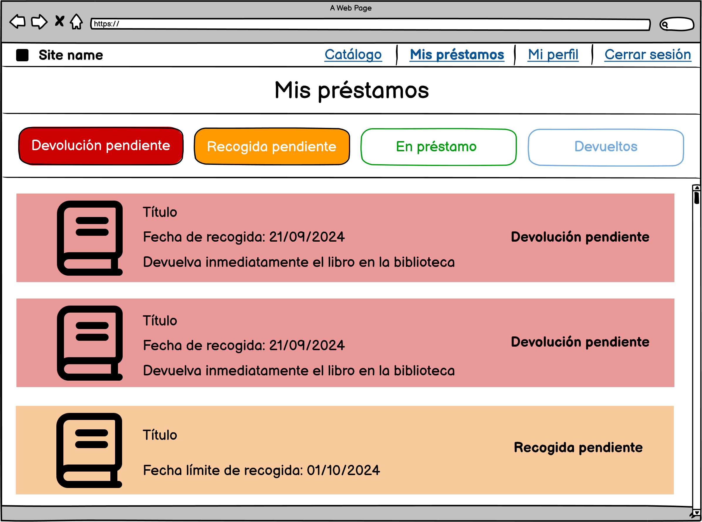

# Desarrollo de una Aplicación Web para la Gestión de Pequeñas Bibliotecas

Este proyecto se centra en el desarrollo de una aplicación web para la gestión bibliotecaria diaria, diseñada específicamente para bibliotecas pequeñas que no están integradas en redes oficiales. El objetivo principal es ofrecer a estas entidades una solución tecnológica accesible y fácil de adoptar, que permita la interacción virtual con sus usuarios de manera eficiente.

## Frontend

Este repositorio contiene el frontend de la aplicación, construido con Next.js. Este frontend proporciona la interfaz a través de la cual los usuarios interactúan con la aplicación, gestionando la navegación entre pantallas y realizando solicitudes al backend para obtener y enviar datos a través de una API RESTful.

### Tecnologías Utilizadas

- **React:** Biblioteca para construir interfaces de usuario.
- **Next.js:** Framework React para el desarrollo del frontend.
- **Tailwind CSS:** Framework para diseñar interfaces de usuario mediante la aplicación de clases CSS directamente en los elementos HTML.

## Requisitos previos

Antes de comenzar, asegúrate de tener instalados los siguientes programas y herramientas en tu sistema:

1. **Node.js** (versión 18.x.x o superior):
   - Node.js es necesario para ejecutar el entorno de JavaScript en el que Next.js funciona.
   - Puedes descargar la última versión desde [aquí](https://nodejs.org/).
   - Verifica si está instalado ejecutando:
     ```bash
     node -v
     ```

2. **npm** (versión 6.x.x o superior):
   - npm es el gestor de paquetes de Node.js, y se instala automáticamente junto con Node.js.
   - Verifica si está instalado ejecutando:
     ```bash
     npm -v
     ```

3. **Git** (para clonar el repositorio):
   - Necesitas Git para clonar este repositorio en tu máquina local.
   - Descárgalo desde [aquí](https://git-scm.com/downloads).

4. **Acceso al backend Strapi**:
   - Asegúrate de que el servidor backend de Strapi esté en funcionamiento y accesible. 
   - Para conectar el frontend con el backend, deberás configurar la variable de entorno correspondiente en el archivo `.env.local` y asignarle la URL de la API.
   - La URL por defecto es `http://localhost:1337`, pero puede variar según tu configuración.

## Instalación

Sigue estos pasos para clonar el repositorio, instalar las dependencias y configurar el frontend correctamente.

1. **Clona el repositorio:**

   Usa Git para clonar el repositorio en tu máquina local:
   ```bash
   git clone https://github.com/MiguelLabrada/biblio_next.git
    ```

2. **Accede al directorio del proyecto:**

    Una vez clonado, navega al directorio del proyecto:
    ```bash
    cd biblio_next
    ```

3. **Instala las dependencias:**

    Ejecuta el siguiente comando para instalar todas las dependencias necesarias:
    ```bash
    npm install
    ```

4. **Configura las variables de entorno:**

    Crea un archivo `.env.local` en el directorio raíz del proyecto y añade la siguiente variable necesaria:
    ```bash
    NEXT_PUBLIC_API_URL=http://localhost:1337
    ```
    Ajusta `NEXT_PUBLIC_API_URL` para que apunte a la URL de tu servidor backend Strapi.


5. **Inicia el servidor de desarrollo:**

    Una vez instaladas las dependencias, puedes iniciar el servidor de desarrollo ejecutando:
    ```bash
    npm run dev
    ```

6. **Accede a la aplicación:**

    Después de ejecutar el servidor, abre tu navegador y navega a:
    ```bash
    http://localhost:3000
    ```
    Aquí podrás interactuar con la aplicación y probar las diferentes funcionalidades del frontend.


## Prototipos

A continuación se presenta el diseño inicial de los prototipos de la aplicación:

- **Inicio de sesión**:
  

- **Solicitud de registro**:
  

- **Perfil**:
  

- **Catálogo para usuarios no autenticados**:
  

- **Catálogo para usuarios autenticados**:
  

- **Información detallada de un libro**:
  

- **Gestión de mis reservas y préstamos**:
  
  

- **Préstamo de un libro en línea por el bibliotecario**:
  

- **Gestión de las reservas y préstamos totales por el bibliotecario**:
  
  

- **Información del usuario asociado a un préstamo**:
  

- **Gestión de las solicitudes de registro de usuarios**:
  

- **Información detallada de una solicitud de registro de usuario**:
  