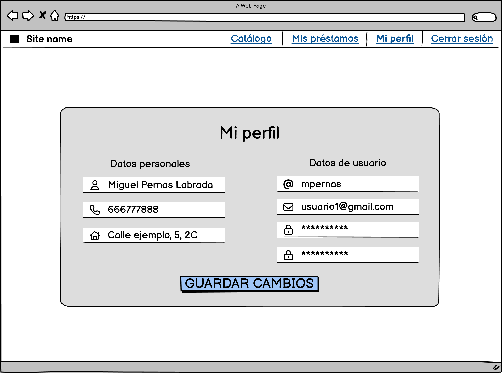

# Desarrollo de una aplicación web para la gestión de pequeñas bibliotecas

Este proyecto se centra en el desarrollo de una aplicación web para la gestión bibliotecaria diaria, diseñada específicamente para bibliotecas pequeñas que no están integradas en redes oficiales. El objetivo principal es ofrecer a estas entidades una solución tecnológica accesible y fácil de adoptar, que permita la interacción virtual con sus usuarios de manera eficiente.

## Prototipos

A continuación se presenta el diseño inicial de los prototipos de la aplicación:

- Inicio de sesión:

- Solicitud de registro:

- Perfil:

- Catálogo para usuarios no autenticados:

- Catálogo para usuarios autenticados:

- Información detallada de un libro:

- Gestión de mis reservas y préstamos:

- Préstamo de un libro en línea por el biblitecario:

- Gestión de las reservas y préstamos totales por el biblitecario:

- Información del usuario asociado a un préstamo:

- Gestión de las solicitudes de registro de usuarios:

- Información detallada de una solicitud de registro de usuario:

